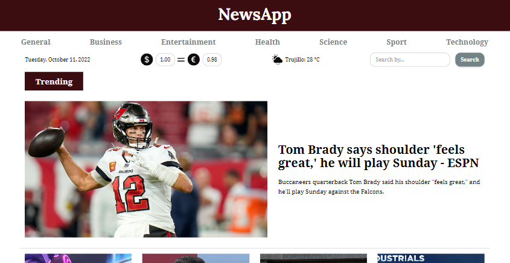

# News App

## Tabla de Contenidos

- [News App](#news-app)
  - [Tabla de Contenidos](#tabla-de-contenidos)
  - [Preview](#preview)
    - [Screenshot](#screenshot)
  - [Proyecto](#proyecto)
    - [Links](#links)
  - [Proceso](#proceso)
    - [Construido con:](#construido-con)
    - [Recursos Utilizados](#recursos-utilizados)
  - [Autores](#autores)
    - [OpenBootcamp Community](#openbootcamp-community)

## Preview

### Screenshot

## Proyecto

Este proyecto fue realizado con la participación de los integrantes de OpenBootcamp, y es parte de una dinámica llamada "OpenWeekapps"

### Links

- Repositorio: [Solución](https://github.com/Open-Bootcamp/news-app)
- Preview: [Live App](https://news-app-seven-iota.vercel.app/)

## Proceso

### Construido con:

- Mobile-first
- Diseño Responsivo
- Flex y Grid Layout
- React
- Tailwind

### Recursos Utilizados

- [React Docs](https://beta.reactjs.org/)
- [MDN Web Docs](https://developer.mozilla.org/es/docs/Web)
- [Tailwind Docs](https://tailwindcss.com/)

## Autores

### OpenBootcamp Community

- GitHub - [@lMahesvara](https://github.com/lMahesvara)
- GitHub - [@g4rcia-2003](https://github.com/g4rcia-2003)
- GitHub - [@lemartinezm](https://www.github.com/lemartinezm)